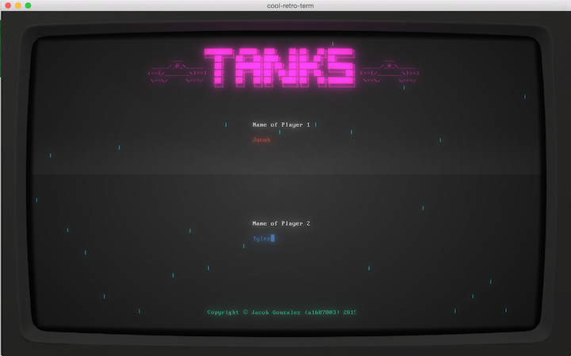
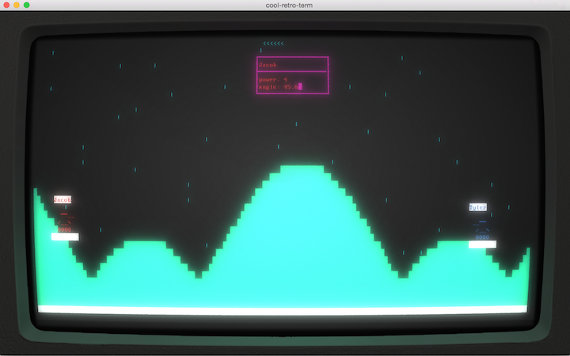
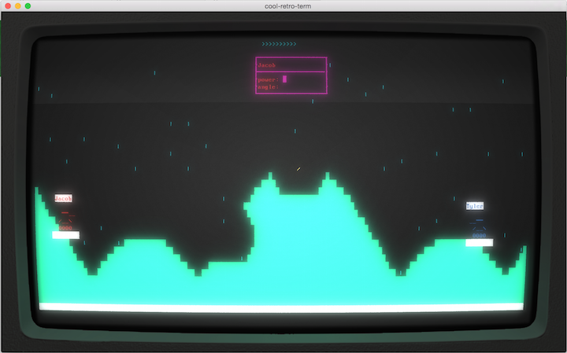

# Tanks
2 player tank game in terminal in c++ 98. Using only escape sequences for drawing. (**no ncurses!**) Has sound and music.
Builds on Linux and OSX.

##Usage:

**Basic usage:**
  - cd to cloned directory
  - make
  - chmod +x runforever.sh
  - ./runforever.sh

**Detailed**

*make*
  - all
  - test
  - game
  - clean
  - debug

*run*
  -  ./game
  - ./game --help
  - ./game (args found in --help)

Sound files (.wav) are not included in the repo (too big). Game will run without them.
